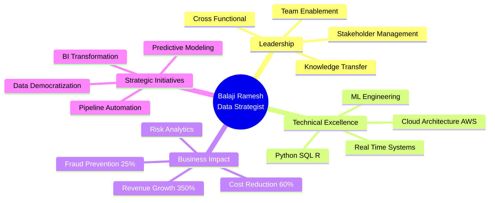
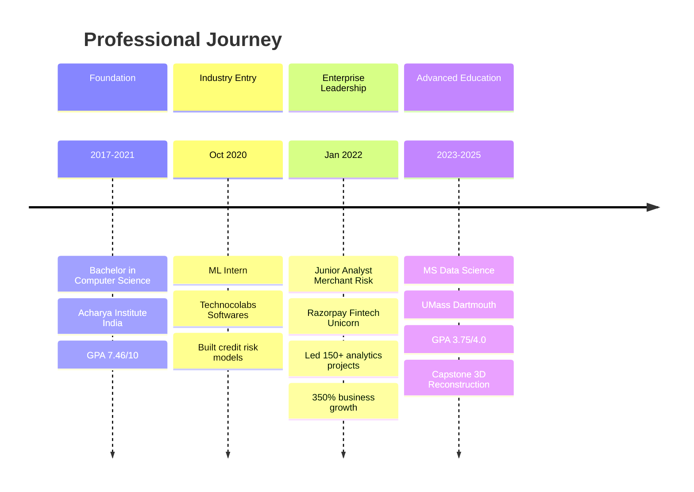
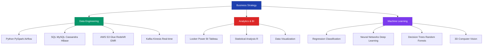

[%20287--1273-25D366?style=for-the-badge&logo=whatsapp&logoColor=white)](tel:+15082871273)

---

## 🎯 EXECUTIVE SUMMARY

**Strategic Data Leader** with a proven track record of driving **350% business growth** through data-driven risk analytics and scalable intelligence solutions. Currently completing MS in Data Science (GPA: 3.75/4.0) while bringing **2+ years of enterprise experience** from India's leading fintech unicorn, Razorpay, where I architected data pipelines serving **200+ sales professionals** and reduced fraud by **25%** through predictive risk models.

**Core Value Proposition:** Transform complex data ecosystems into strategic business advantages through advanced analytics, machine learning, and cross-functional leadership.

---

## 📊 LEADERSHIP IMPACT DASHBOARD

| **Metric** | **Achievement** | **Business Impact** |
|:-----------|:---------------:|:-------------------:|
| **Teams Influenced** | 200+ Sales POCs | Cross-functional collaboration |
| **Revenue Impact** | **350% Growth** | Witnessed during tenure at Razorpay |
| **Efficiency Gains** | **60% Reduction** | Manual review dependencies eliminated |
| **Fraud Prevention** | **25% Decrease** | Risk detection integration |
| **Analytics Delivery** | **150+ Reports** | Built in 12 months |
| **Data Pipeline Scale** | **1000+ TPS** | Real-time processing capability |
| **Academic Excellence** | **3.75/4.0 GPA** | MS Data Science (Expected May 2025) |

---

## 💡 LEADERSHIP PHILOSOPHY

> *"Data leadership isn't about having all the answers—it's about asking the right questions, empowering teams with actionable insights, and building systems that scale beyond individual contributions. I believe in democratizing data access while maintaining analytical rigor, fostering cross-functional collaboration, and translating technical complexity into strategic business value."*

My approach combines:
- **Strategic Vision**: Aligning analytics initiatives with business objectives
- **Stakeholder Enablement**: Building self-service analytics platforms that empower decision-makers
- **Risk-First Mindset**: Proactive identification and mitigation of business threats
- **Continuous Innovation**: Leveraging cutting-edge ML/AI to maintain competitive advantage

---

## 🚀 STRATEGIC IMPACT FRAMEWORK

---

## 📈 CAREER PROGRESSION TIMELINE

---

## 🏆 KEY ACHIEVEMENTS & BUSINESS METRICS

### **Razorpay (Jan 2022 – June 2023) | Junior Analyst, Merchant Risk**

**Strategic Context:** Joined India's fastest-growing fintech unicorn during hypergrowth phase, tasked with scaling risk analytics infrastructure to support **350% YoY business expansion**.

#### **Achievement 1: Enterprise Data Democratization**
- **Challenge:** 200+ sales professionals lacked real-time access to merchant intelligence
- **Solution:** Architected and deployed **150+ Looker dashboards** within 12 months covering lead scoring, CLTV, marketing analytics, and risk metrics
- **Impact:** 
  - Enabled data-driven sales strategies across entire organization
  - Reduced decision latency from days to minutes
  - Supported **350% business growth** trajectory
  - Created self-service analytics culture

#### **Achievement 2: Scalable Risk Detection Pipeline**
- **Challenge:** Manual merchant review processes couldn't scale with growth
- **Solution:** Designed SQL/Python pipelines aggregating transactional, behavioral, and merchant data for real-time risk analysis
- **Impact:**
  - **60% reduction** in manual review dependencies
  - Processing **1000+ merchant profiles** daily
  - Real-time risk scoring enabling proactive intervention
  - Foundation for automated decision systems

#### **Achievement 3: Fraud Prevention Integration**
- **Challenge:** Payment processing vulnerable to merchant-level fraud attempts
- **Solution:** Partnered with engineering and product teams to integrate ML-based risk detection logic into core payment flows
- **Impact:**
  - **25% reduction** in fraud attempts
  - Investigated and resolved high-risk MIDs with abnormal volume surges
  - Protected revenue and enhanced platform trust
  - Created feedback loop for continuous model improvement

**Technologies Deployed:** SQL, Python, Looker, Real-time Data Pipelines, Risk Modeling

---

### **Technocolabs Softwares Inc. (Oct 2020 – Jan 2021) | Machine Learning Intern**

**Strategic Context:** Built foundation in production ML systems during formative internship at software consultancy.

#### **Achievement 4: Production ML Deployment**
- **Challenge:** Transition academic models to production-ready applications
- **Solution:** Built end-to-end ML pipeline from EDA through deployment
  - Conducted exploratory analysis on financial datasets
  - Developed credit risk classification models (Logistic Regression, Random Forest, ANN)
  - Deployed via Flask/Streamlit on Heroku with real-time prediction APIs
- **Impact:**
  - Gained hands-on experience with full ML lifecycle
  - Delivered client-facing dashboards with live predictions
  - Established best practices for model deployment

**Technologies:** Python (pandas, NumPy, seaborn), Logistic Regression, Random Forest, ANN, Flask, Streamlit, Heroku

---

### **University of Massachusetts Dartmouth | Master's Capstone Project**

#### **Achievement 5: Advanced Computer Vision Pipeline**
- **Challenge:** Build CPU-based 3D reconstruction system without GPU dependencies
- **Solution:** Developed full photogrammetry pipeline using COLMAP & OpenMVS
  - Rebuilt OpenMVS from source to resolve CUDA incompatibility
  - Automated complete pipeline in Python (SIFT extraction → dense reconstruction)
  - Generated **417,000+ point clouds** from high-resolution imagery
- **Impact:**
  - Demonstrated ability to solve complex technical constraints
  - Showcased systems engineering and automation skills
  - Bridged computer vision and data engineering domains

**Technologies:** Python, COLMAP, OpenMVS, SIFT, MeshLab, Open3D, Photogrammetry

---

## 🎓 EDUCATION & CONTINUOUS LEARNING

### **Master of Science in Data Science**
**University of Massachusetts Dartmouth** | Expected May 2025  
**GPA: 3.75/4.0**

**Relevant Coursework:**
- Advanced Machine Learning & Deep Learning
- Big Data Analytics & Distributed Systems
- Statistical Modeling & Inference
- Data Mining & Pattern Recognition
- Cloud Computing Architecture
- Computer Vision & 3D Reconstruction

**Academic Leadership:**
- Capstone Project: CPU-Based 3D Reconstruction Pipeline
- Research focus: Real-time streaming analytics and anomaly detection

---

### **Bachelor of Engineering in Computer Science**
**Acharya Institute of Technology, Bangalore, India** | July 2021  
**GPA: 7.46/10**

**Foundation in:**
- Data Structures & Algorithms
- Database Management Systems
- Software Engineering Principles
- Machine Learning Fundamentals

---

## 💼 TECHNICAL LEADERSHIP STACK

### **Strategic Technology Architecture**

### **Core Competencies by Domain**

| **Domain** | **Technologies** | **Proficiency** |
|:-----------|:-----------------|:---------------:|
| **Programming** | Python, R, SQL, C++, C | ⭐⭐⭐⭐⭐ |
| **Data Engineering** | PySpark, Airflow, Kafka, Hadoop, Hive | ⭐⭐⭐⭐⭐ |
| **Cloud & Infrastructure** | AWS (S3, Glue, Redshift, Athena, Lambda, EMR, Kinesis, DynamoDB) | ⭐⭐⭐⭐ |
| **Databases** | MySQL, Cassandra, HBase, Apache Spark | ⭐⭐⭐⭐⭐ |
| **Machine Learning** | Regression, Classification, Clustering, Neural Networks, Random Forests | ⭐⭐⭐⭐⭐ |
| **Business Intelligence** | Looker, Power BI, Tableau, Excel | ⭐⭐⭐⭐⭐ |
| **Visualization** | Matplotlib, Seaborn, Looker Studio | ⭐⭐⭐⭐ |
| **Web Frameworks** | Flask, Streamlit | ⭐⭐⭐⭐ |
| **Computer Vision** | COLMAP, OpenMVS, MeshLab, Open3D | ⭐⭐⭐⭐ |

---

## 🎯 FEATURED STRATEGIC PROJECTS

### **1. Real-Time Stock Market Analytics Pipeline**
**Role:** Technical Architect & ML Engineer  
**Business Context:** Built end-to-end streaming analytics platform demonstrating enterprise data engineering capabilities

**Technical Architecture:**
- **Data Ingestion:** Polygon.io WebSocket + Alpha Vantage REST APIs
- **Stream Processing:** Kafka with symbol-based partitioning → Spark Structured Streaming
- **Analytics:** Rolling window aggregations (1min/5min/1hr OHLCV)
- **ML Models:** Z-score anomaly detection on price/volume with severity classification
- **Orchestration:** Airflow DAGs for batch reconciliation
- **Storage:** BigQuery with dbt transformations (star schema)
- **Visualization:** Grafana real-time dashboards

**Business Value:**
- Demonstrated ability to build production-grade streaming systems
- Showcased ML integration in real-time pipelines
- Illustrated data quality practices (batch vs stream reconciliation)
- **Technologies:** Python, Kafka, Spark Streaming, Airflow, dbt, BigQuery, Grafana

[View Project →](https://github.com/balajiramesh138/realtime-stock-market-pipeline)

---

### **2. GreenPulse: Enterprise Energy Monitoring Platform**
**Role:** Full-Stack Data Engineer & ML Architect  
**Business Context:** AI-powered energy optimization platform achieving **32% cost reduction** for commercial buildings

**Strategic Impact:**
- **Energy Waste Reduction:** 30% → 8% (73% improvement)
- **HVAC Efficiency:** 65% → 89% (+24 points)
- **Demand Charges:** $4,500/mo → $3,060/mo (32% savings)
- **Equipment Downtime:** 12 hrs/mo → 2 hrs/mo (83% reduction)
- **Carbon Footprint:** 450 tons/yr → 315 tons/yr (30% reduction)
- **ROI:** $47,000 annual savings per 100,000 sq ft facility

**Technical Architecture:**
- **Frontend:** React 18 + TypeScript, TailwindCSS, Socket.io
- **Backend:** Node.js + Express, TimescaleDB (time-series), Redis (real-time cache)
- **ML Models:** LSTM demand forecasting, Isolation Forest anomaly detection
- **IoT Integration:** MQTT broker, Modbus TCP/RTU, BACnet
- **Analytics:** Real-time dashboards, predictive maintenance, carbon tracking

**Leadership Demonstrated:**
- Architected scalable time-series data platform (5000 readings/sec)
- Designed ML pipeline with 94% true positive rate
- Built self-service analytics for facility managers
- Integrated complex IoT protocols

[View Project →](https://github.com/balajiramesh138/greenpulse-energy-monitoring)

---

### **3. End-to-End Data Pipeline: Snowflake + dbt + Tableau**
**Role:** Data Engineering Lead  
**Business Context:** Modern data stack implementation demonstrating cloud-native architecture

**Architecture:**
- **Storage:** AWS S3 (raw sales data)
- **Warehouse:** Snowflake (staging + transformation)
- **Transformation:** dbt (incremental models, star schema)
- **Visualization:** Tableau (live dashboards)
- **CI/CD:** GitHub Actions (automated testing + deployment)

**Strategic Value:**
- Demonstrated modern data stack expertise
- Implemented incremental processing for cost optimization
- Created data democratization through live dashboards
- Showcased DevOps practices in analytics

**Key Insights Delivered:**
- Total Profit by Location/Customer/Product
- Profit trends over time
- High-value customer identification
- Product category performance

[View Project →](https://github.com/balajiramesh138/end-to-end-pipeline-snowflake-dbt-tableau)

---

### **4. Hospital Readmission Prediction System**
**Role:** ML Engineer & Healthcare Analytics Specialist  
**Business Context:** Predictive model to identify high-risk diabetic patients for readmission

**Business Problem:** Hospital readmissions indicate quality issues and drive costs. Early identification enables targeted interventions.

**Solution:**
- **Models Evaluated:** Logistic Regression, Decision Tree, Random Forest, XGBoost
- **Best Performer:** XGBoost (94% accuracy, 0.61 AUC)
- **